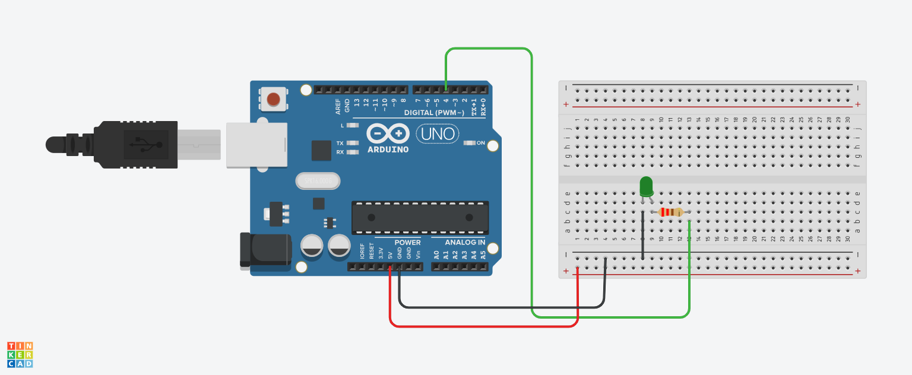

# Aula_01 Pisca-LED Simples
# Introdução
Este projeto utiliza um LED conectado ao Arduino para criar um efeito de piscar.
O LED será acionado e desligado em intervalos de 2 segundos, criando um sinal
visual. Esse sistema é útil para entender a manipulação de saídas digitais no
Arduino e pode ser utilizado como base para projetos mais complexos.

# Componentes Usados
1 Arduino Uno

1 LED

1 Resistor de 220 ohms (para o LED)

Jumpers Macho-Macho

# Montagem do Circuito

# Explicação do Código

 Variável para capturar a porta de conexão do LED
int led = 4;  Pino do LED

 Função para configuração inicial, roda uma vez no início
void setup() {
     Definir configurações do LED como saída
    pinMode(led, OUTPUT);  Define o LED como saída
    
   Função de definição de entrada/saída do dispositivo.
   Recebe 2 parâmetros:
   (porta que o dispositivo está conectado, OUTPUT)
    
}

 Função de execução de instruções infinitas/loop
void loop() {
     Ligar o LED (HIGH)
    digitalWrite(led, HIGH);
     Adicionar pausa (delay)
    delay(2000);  Espera 2 segundos com o LED ligado

  Desligar o LED (LOW)
  digitalWrite(led, LOW);
  delay(2000); // Espera 2 segundos com o LED desligado
}
Definição das Variáveis
led: Pino conectado ao LED para controle de saída.
Funções Principais
setup(): Configura o pino do LED como saída, permitindo que o Arduino controle seu estado.
loop(): Executa continuamente a ação de ligar e desligar o LED em intervalos de 2 segundos, criando um efeito de piscar.
