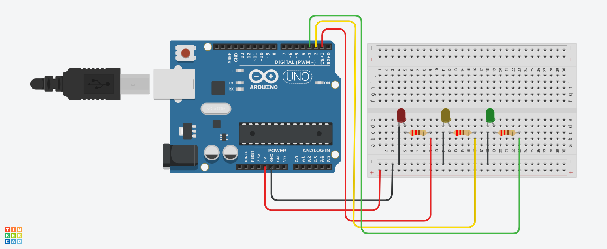

# Aula_01 semáforo Simples

# Introdução

Este projeto utiliza três LEDs (vermelho, amarelo e verde) conectados ao Arduino para simular um semáforo.
Cada LED acenderá em sequência, representando os estados do sinal. O LED vermelho ficará ligado por 5
segundos, seguido pelo amarelo e, finalmente, pelo verde. Esse sistema é uma ótima maneira de entender
como controlar múltiplas saídas digitais em Arduino.

# Componentes Usados
1 Arduino Uno

1 LED Vermelho

1 LED Amarelo

1 LED Verde

3 Resistor de 220 ohms (um para cada LED)

Jumpers Macho-Macho

# Montagem do Circuito

# Explicação do Código

 Variáveis dos LEDs
int ledVermelho = 1;   Pino do LED vermelho
int ledAmarelo = 2;    Pino do LED amarelo
int ledVerde = 3;      Pino do LED verde

void setup() {
     Definir LEDs como saída
    pinMode(ledVermelho, OUTPUT);
    pinMode(ledAmarelo, OUTPUT);
    pinMode(ledVerde, OUTPUT);
}

void loop() {
     Ligar o LED vermelho
    digitalWrite(ledVermelho, HIGH);  Liga vermelho
    digitalWrite(ledAmarelo, LOW);     Desliga amarelo
    digitalWrite(ledVerde, LOW);       Desliga verde
    delay(5000);  Espera 5 segundos
    
   Ligar o LED amarelo
  digitalWrite(ledVermelho, LOW);    Desliga vermelho
  digitalWrite(ledAmarelo, HIGH);    Liga amarelo
  digitalWrite(ledVerde, LOW);       Desliga verde
  delay(5000);  Espera 5 segundos
    
   Ligar o LED verde
   digitalWrite(ledVermelho, LOW);    Desliga vermelho
  digitalWrite(ledAmarelo, LOW);     Desliga amarelo
  digitalWrite(ledVerde, HIGH);      Liga verde
   delay(5000);  Espera 5 segundos
}
Definição das Variáveis
ledVermelho: Pino conectado ao LED vermelho.
ledAmarelo: Pino conectado ao LED amarelo.
ledVerde: Pino conectado ao LED verde.
Funções Principais
setup(): Configura os pinos dos LEDs como saída, permitindo que o Arduino controle seu estado.
loop(): Executa continuamente a sequência de ligar e desligar os LEDs em intervalos de 5 segundos, simulando o funcionamento de um semáforo.
Este projeto é uma excelente maneira de aprender sobre controle de múltiplas saídas no Arduino. Você pode expandi-lo para adicionar mais funcionalidades, como um botão para iniciar a sequência ou sensores para controle automático.
