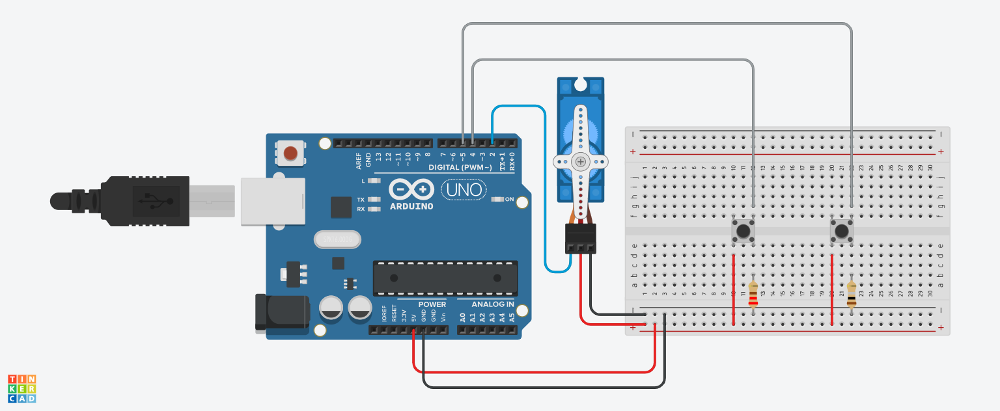

# Projeto de Controle de Servo Motor

# Introdução
Este projeto utiliza um servo motor para demonstrar como controlar a posição
de um motor em resposta a botões de entrada. O objetivo é permitir que um 
usuário avance ou recue a posição do servo motor em incrementos de 1 grau.
O projeto foi desenvolvido usando a biblioteca Servo do Arduino, facilitando
a manipulação do motor.

# Componentes Usados
Arduino Uno: Microcontrolador que gerencia a lógica do sistema.

Servo Motor: Motor que pode ser posicionado em ângulos específicos, controlado por sinais do Arduino.

Botões: Dois botões para controlar o movimento do servo motor (avançar e recuar).

Resistores (10kΩ): Para evitar leituras flutuantes nos botões.

Fios de Conexão: Fios jumpers para realizar as ligações entre os componentes e a placa Arduino.

# Montagem do Circuito

# Explicação do Código

 Biblioteca do servo motor 
#include <Servo.h>

 Criando objeto do tipo Servo Motor
Servo objetoServo;

 Variável para salvar a porta que o servo está
int servo = 2;

 Variáveis para as portas dos botões
int botaoAvancar = 4;   botão para avançar
int botaoRecuar = 5;    botão para recuar

 Variável para posição do motor
int posicao = 0;

void setup() {
  Inicializando o servo na porta digital 2 
  objetoServo.attach(servo);
  
  Servo começa na posição zero
  objetoServo.write(posicao);
  
   Definir botões como entrada
  pinMode(botaoAvancar, INPUT);
  pinMode(botaoRecuar, INPUT);
}

void loop() {
   Se o botão de avançar for pressionado e a posição do servo estiver menor que 180
  if (digitalRead(botaoAvancar) == HIGH && posicao < 180) {
    posicao++;  Aumenta 1° de posição
    objetoServo.write(posicao); Manda o motor para a nova posição
    delay(1000);  Aguarda 1 segundo para a próxima leitura
  }

   Se o botão de recuar for pressionado e a posição do servo estiver maior que 0
  if (digitalRead(botaoRecuar) == HIGH && posicao > 0) {
    posicao--;  Diminui 1° de posição
    objetoServo.write(posicao);  Manda o motor para a nova posição
    delay(1000);  Aguarda 1 segundo para a próxima leitura
  }
}
Funcionamento
Inicialização: No setup(), o servo motor é inicializado e os botões são configurados como entradas.
Loop Principal: O loop() verifica continuamente o estado dos botões:
Se o botão de avançar for pressionado e a posição atual do servo for menor que 180°, o servo avança 1°.
Se o botão de recuar for pressionado e a posição do servo for maior que 0°, o servo recua 1°.
Delay: Um delay de 1 segundo após cada movimentação evita leituras rápidas e repetitivas.
Esse projeto é uma excelente introdução ao controle de motores com Arduino, mostrando como interagir fisicamente com um sistema usando botões.
